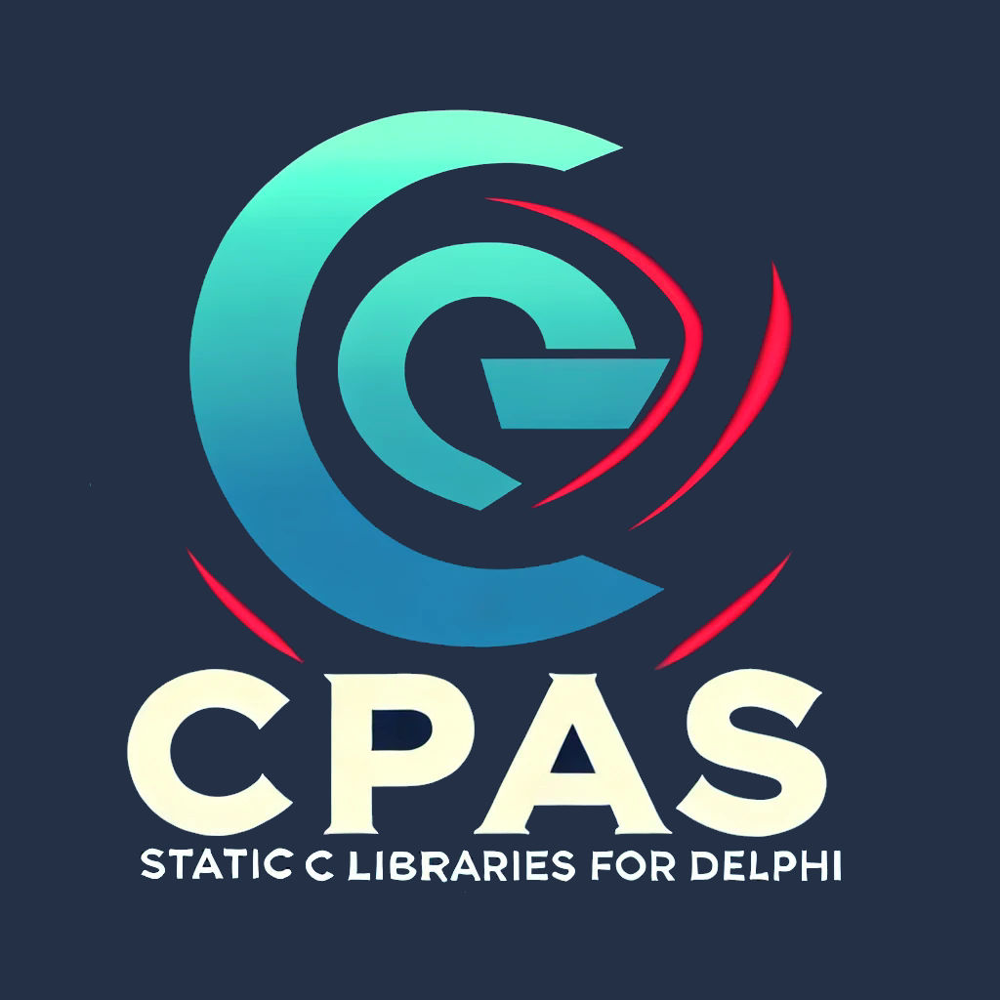

[](https://discord.gg/tPWjMwK) [](https://twitter.com/tinyBigGAMES)

CPas is a collection of hand-picked, high-quality C libraries, compiled into a single translation unit and seamlessly integrated into Delphi. This approach eliminates the need for external DLLs, runtime extraction, or loading them in memory, simplifying the development process and reducing potential compatibility issues, such as antivirus 🛡️ interference. The project has been developed and extensively tested on 🪟 Windows 11 with <a href="https://www.embarcadero.com/products/rad-studio" target="_blank">RAD Studio 12.2</a>, and is designed to be fully compatible with 🪟 Windows 10, 64-bit and higher. This makes the setup ideal for developers looking for a streamlined and efficient way to leverage C libraries directly in Delphi.

## 🔑 Key Features
- **Fully Integrated**: All the C dependencies are linked directly into Delphi, requiring no external tools beyond RAD Studio 12.2. This makes it easy for developers to get started without needing to worry about complex setups or additional tools.
- **🛠️ Latest Clang-based Toolchain**: The project uses the clang-based toolchainin in C++ Builder to compile C sources directly from within the IDE. This ensures high compatibility and performance, leveraging the modern capabilities of RAD Studio.
- **🔄 Streamlined Workflow**: No DLLs are required at runtime. All dependencies are consolidated into a single translation unit (`library.c`) and linked into Delphi using `{$L library.o}`. This drastically simplifies deployment and reduces the number of files needed to ship with your application.
- **🛡️ Reduced Errors and Interference**: By eliminating the need for runtime DLL handling, the approach significantly reduces the chance of runtime errors and minimizes issues that could be caused by antivirus software, ensuring a smoother development and deployment process.

## ⚙️ System Requirements
- **🧩 Delphi Version**: RAD Studio 12.2 or newer is required to compile the C sources. Leveraging the latest Delphi features ensures compatibility and performance.
- **💻 Platform**: The libraries are designed for 🪟 Windows 10 64-bit or higher, providing compatibility with most modern Windows environments.
- **✅ Tested On**: The entire project has been developed and thoroughly tested on 🪟 Windows 11 with Delphi 12.2, ensuring that it works seamlessly in this environment.

## 🚀 Getting Started
To get started with Static C Libraries for Delphi, you can download the latest version from the GitHub repository:

[⬇️ Download the latest version](https://github.com/tinyBigGAMES/CPas/archive/refs/heads/main.zip)

Once downloaded, you can easily integrate the provided libraries into your Delphi projects, taking advantage of the precompiled object `.o` files to start developing without needing to deal with compiling C code separately. All you need to do is add `CPas.*` to your uses section.

## 📚 Available Static Libraries
The following is a list of the current static C libraries available in this project, each carefully chosen to provide essential functionality for modern applications and 🎮 game development:

| 🏷️ Name                                            | 🗂️ Category  | 📝 Description|
|----------------|-----------|-------------|
| [GLFW](https://github.com/glfw/glfw)               | 🪟 Windowing  | Multi-platform library for creating windows and handling input events, suitable for building powerful graphical applications.                           |
| [miniaudio](https://github.com/mackron/miniaudio)  | 🔊 Audio      | An audio playback and capture library that supports a wide variety of audio formats, making it ideal for games and multimedia applications.             |
| [pl_mpeg](https://github.com/phoboslab/pl_mpeg)    | 📺 Media      | A single-header library for decoding MPEG-1 video, allowing developers to integrate video playback functionality directly into their applications.      |
| [RGFW](https://github.com/ColleagueRiley/RGFW)     | 🪟 Windowing  | A cross-platform lightweight single-header simple-to-use window abstraction library for creating graphical programs or libraries.                        |
| [raudio](https://github.com/raysan5/raudio)        | 🔊 Audio      | A simple and easy-to-use audio library based on miniaudio.                                                                                              |
| [stb_image](https://github.com/nothings/stb)       | 🖼️ Graphics   | Image loading library supporting multiple formats, making it easy to load textures and images in a variety of common formats.                            |
| [stb_image_write](https://github.com/nothings/stb) | 🖼️ Graphics   | Image writing library for PNG, BMP, TGA, and JPG images, useful for saving screenshots or exporting image data.                                          |
| [stb_truetype](https://github.com/nothings/stb)    | 🖋️ Graphics   | Library for parsing TrueType font files, providing an easy way to render fonts and text in your applications.                                            |

These libraries provide a comprehensive range of functionalities for building sophisticated applications and 🎮 games in Delphi, without the hassle of managing external dependencies. By using static linking, you can avoid compatibility issues related to DLL versions and reduce the need for runtime dependencies, simplifying both development and deployment.

## ⚙️ How It Works
All the C libraries are compiled within RAD Studio 12.2 using the latest clang-based toolchain, and the result is consolidated into a single precompiled object file, `library.o`. This is then linked directly into the Delphi project using the `$L` directive. This approach ensures a consistent and streamlined development environment, making the integration process as seamless as possible:

```delphi
{$L library.o}
```

By following this approach, developers can enjoy the full benefits of these popular C libraries without worrying about DLL management, compatibility issues, or antivirus false positives. The entire setup is optimized to be as developer-friendly as possible, reducing the number of moving parts and ensuring that your development environment remains predictable and easy to maintain.

## 🤝 Contributions
Contributions are highly encouraged! If you have additional static libraries you would like to add, or if you want to improve the existing codebase, feel free to submit a pull request. Additionally, if you encounter any issues or have suggestions, please open an issue in the repository. The goal is to make Static C Libraries for Delphi a robust and versatile resource for Delphi developers, and your contributions can help achieve that.

<a href="https://github.com/tinyBigGAMES/mambagametoolkit/graphs/contributors">
  
</a>

## 📜 License
This project is licensed under the BSD-3-Clause License - see the [LICENSE](https://github.com/tinyBigGAMES/CPas#BSD-3-Clause-1-ov-file) file for details. This license allows you to freely use, modify, and distribute the toolkit, making it a great choice for open-source projects and commercial endeavors alike.

## 🛟 Support

- <a href="https://github.com/tinyBigGAMES/CPas/issues" target="_blank">Issues</a>
- <a href="https://github.com/tinyBigGAMES/CPas/discussions" target="_blank">Discussions</a>
- <a href="https://discord.gg/tPWjMwK" target="_blank">Discord</a>
- <a href="https://youtube.com/tinyBigGAMES" target="_blank">YouTube</a>
- <a href="https://twitter.com/tinyBigGAMES" target="_blank">X (Twitter)</a>
- <a href="https://tinybiggames.com/" target="_blank">tinyBigGAMES</a>

Happy coding! 💻✨

<p align="center">

</p>
<h5 align="center">

Made with :heart: in Delphi
</h5>